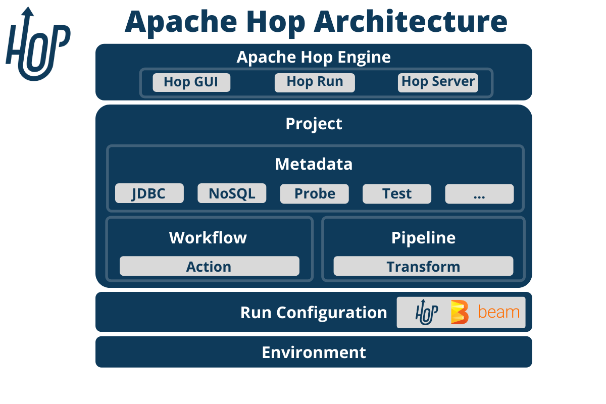

# 🧰 Was ist Apache Hop?

**Apache Hop** (Hop Orchestration Platform) ist ein **Open-Source-Datenintegrations- und Orchestrierungs-Framework**, das es Data Engineers ermöglicht, **grafisch oder skriptbasiert ETL/ELT-Pipelines** zu entwickeln, zu verwalten und auszuführen – sowohl lokal als auch in produktiven Umgebungen.

---

## 📊 Architekturüberblick

Apache Hop besteht aus:

- **Hop GUI**: Lokales grafisches Entwicklungstool
- **hop-run**: Kommandozeilentool zum Ausführen von Pipelines und Workflows
- **Hop Server**: REST-basiertes API für Remote-Ausführungen und Orchestrierung
- **Metadata System**: Für Umgebungen, Verbindungen, Variablen etc.

---

## 🚀 Kernfunktionalitäten

| Feature                     | Beschreibung                                                                 |
|-----------------------------|------------------------------------------------------------------------------|
| 🧱 Modular                  | Pipelines (Transformationen) & Workflows (Steuerlogik) getrennt modellierbar |
| 🖥️ GUI + CLI                | Entwickeln mit Hop GUI, Ausführen mit `hop-run` oder in Docker/K8s            |
| 🔁 Wiederverwendbar        | Subpipelines, Parameter, Umgebungsvariablen                                  |
| 💾 Breite Datenquellen     | DBs, Files, Kafka, REST, Cloud Storage, etc.                                 |
| 📄 Metadatengetrieben      | Alles als Datei im JSON/YAML-Format versionierbar                           |
| 🔌 Erweiterbar             | Pluginsystem für eigene Schritte und Tools                                   |

---

## 🎯 Warum Apache Hop?

Apache Hop ist ideal für **moderne Data Engineering Workflows**, weil es:

- **visuelle Entwicklung** mit **DevOps-Kompatibilität** verbindet
- mit **DataOps & Data Mesh**-Paradigmen harmoniert
- eine **leichtgewichtige und kostenfreie, nach Apache-lizenzierte Alternative zu Airflow (mehr Scheduling, Orchestration), Talend oder Informatica** bietet

---

## 📦 Typische Einsatzszenarien

- ETL/ELT-Prozesse im DWH oder Data Lake
- Datenbereinigung & Anreicherung
- Orchestrierung komplexer Datenworkflows
- Batch- & Streaming-Integration
- Vorbereitung von Daten für ML/Analytics
- Bereitstellen von Daten via API

---

## 🔗 Weiterführende Links

- 🌐 Offizielle Website: [https://hop.apache.org](https://hop.apache.org)
- 📚 Dokumentation: [https://hop.apache.org/manual/latest/](https://hop.apache.org/manual/latest/)
- 🛠️ GitHub Repo: [https://github.com/apache/hop](https://github.com/apache/hop)
- 💬 Community Slack: [https://hop.apache.org/community/slack/](https://hop.apache.org/community/slack/)
- 🧪 Tutorials & Beispiele: [https://hop.apache.org/docs/](https://hop.apache.org/docs/)

---

## 🧠 Empfehlung

Wenn du nach einem Open-Source-Werkzeug suchst, das dich bei der Erstellung von **wiederholbaren, testbaren, modularen und produktionsreifen Datenpipelines** unterstützt – und gleichzeitig mit modernen Prinzipien wie Data Mesh oder DataOps harmoniert – ist Apache Hop eine ausgezeichnete Wahl.
